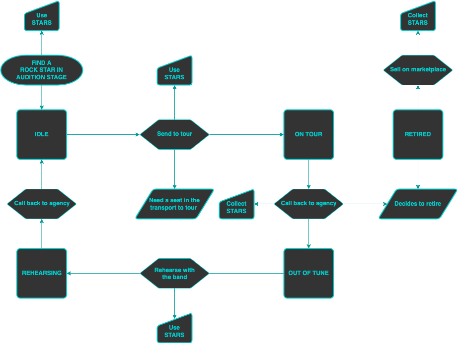

# :icon-iterations: Ecosystem

In this section, we have detailed information about how the ecosystem works.

---

---

## Find a Rock Star

**Rock Stars** are found to be managed from the Audition Stage using STARS each. The price of this search is fixed. Each **Rock Star** has a Salary that represents the income that they will generate in their tour.

After completing a full tour and being called back on the agency, the **Rock Star** will need to rehearse with the band (the rehearse time will be equal to the time spent in tour).

Each **Rock Star** has a maximum number of tours.

Upon reaching this limit, the **Rock Star** retires and no longer goes on tour.

The only option will be to sell it on the marketplace.

---

## Rock Star cycle

**Idle:**

The **Rock Star** is idle. Create a tour for the pro to showcase their talents to the public.

**On Tour:**

The **Rock Star** is on tour. Wait for the tour to end to bring the pro back to your agency.

**Out of Tune:**

The **Rock Star** is out of tune. Send the pro to rehearse with the band.

**Rehearsing:**

The **Rock Star** is rehearsing with the band.

**Retired:**

The **Rock Star** is retired. Sell the pro in marketplace to get some profit.
