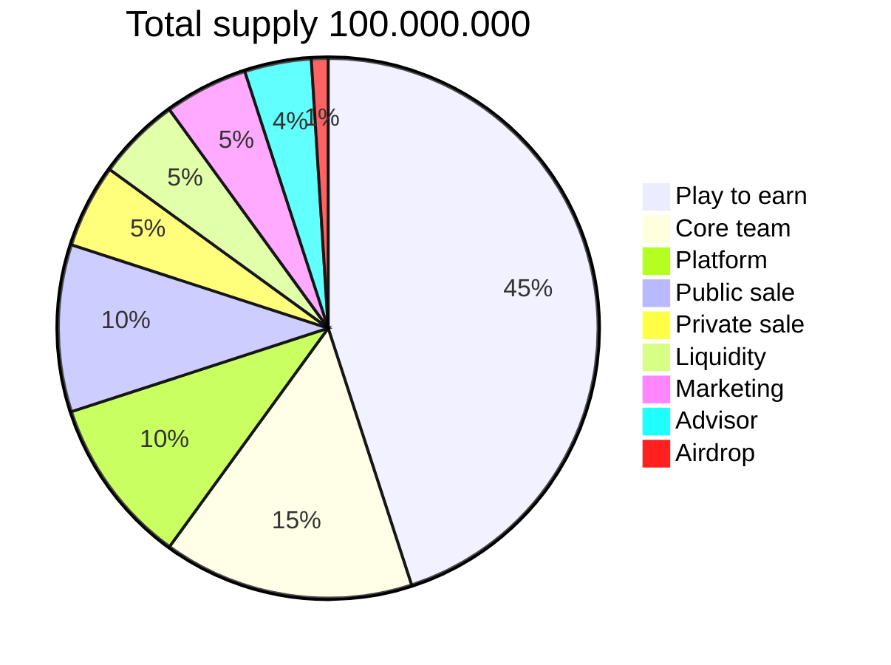

# :icon-graph: ASTRO

## What is the ASTRO Token?

ASTRO Token is the token for **CryptoStars - Rock**. You can earn it exchanging STARS - ASTRO or buying them at PancakeSwap.

[!badge size="2xl" text="Official Contract: To Be Announced 2022 Q1"]

---

## ASTRO Hard Cap

The ASTRO token has a hard cap of 100.000.000 tokens.

---

## Tokenomics

---

| &nbsp;           | Supply   | Percent  | Vesting Period |
| ---------------- | -------- | -------- | -------------- |
| Play To Earn     | 45M      | 45%      |                |
| Core team        | 15M      | 15%      | 25 months      |
| Platform         | 10M      | 10%      | 12 months      |
| Public sale      | 10M      | 10%      |                |
| Private sale     | 5M       | 5%       |                |
| Liquidity        | 5M       | 5%       |                |
| Marketing        | 5M       | 5%       | 20 months      |
| Advisor          | 4M       | 4%       |                |
| Airdrop          | 1M       | 1%       | 10 months      |
| **Total Amount** | **100M** | **100%** |                |
